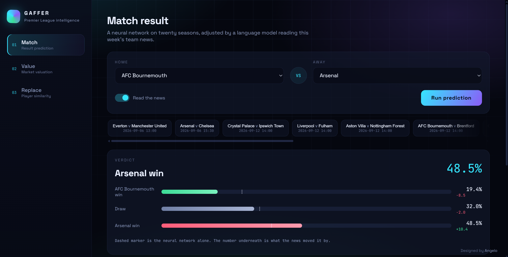

# Gaffer

Premier League intelligence. Three machine learning models behind one dashboard:
predict a match result, value a player, and find the player who would replace him
best.

Built as a university project, but the interesting part is not that the models
exist. It is what happened when I measured them honestly. Two of the three
notebooks contain a result where the first version scored better and was wrong,
and finding that out is documented in the code rather than hidden.



---

## What it does

**Match result.** Pick two teams, get win, draw or loss probabilities. Two
branches produce the answer. A neural network reads twenty seasons of results,
Elo ratings and rolling form. At the same time, a language model searches this
week's news about the fixture, extracts who is injured or suspended, and looks
each name up in a squad importance table built from actual playing data. A key
striker missing moves the line about thirteen points. A fringe defender moves it
about one and a half.

**Market value.** Search a player, get what the model thinks he is worth from
age, output, playing time and club strength, next to what Transfermarkt says.

**Replacement finder.** Search a player, get the players who play most like him,
ranked by style similarity within his position, with filters for age and budget
and a radar chart showing where the two profiles differ.

---

## Results, honestly

### Match prediction

| model | accuracy | log loss | draws predicted |
|---|---|---|---|
| always pick home | 42.6% | 1.0810 | 0 |
| logistic regression | 46.8% | 1.0574 | 2 |
| **XGBoost** | **47.9%** | **1.0456** | 1 |
| neural network, calibrated | 45.5% | 1.0515 | 17 |
| Bet365 closing odds | 48.9% | 1.0185 | 0 |

Tested on the 2025/26 season, 380 matches.

Three class football prediction has a hard ceiling. Bookmakers, who know the
lineups an hour before kickoff, usually land around 53 to 55 percent. In this
particular season they managed 48.9, so the season itself was unusually chaotic.
XGBoost landing one point behind them is a good result, and I would rather report
that than pretend the neural network won.

**Draws are not predictable from this data.** The network was tuned twice, once
aggressively toward draws and once mildly. Aggressive predicted 70 and got 21
right. Mild predicted 17 and got 2. Neither helped accuracy. Bet365 predicted
zero draws all season and still beat everyone. That is a finding about the
problem, not a failure of the model.

The network was also badly miscalibrated before temperature scaling: it ranked
matches correctly and then squashed its probabilities toward the middle. That
matters more here than usual, because the news branch shifts those probabilities,
and shifting a meaningless number gives you a different meaningless number.

### Market value

| model | previous value included | median error | within 25% | log R2 |
|---|---|---|---|---|
| XGBoost, absolute target | no | 51.9% | 16.4% | 0.705 |
| lookup table by position and age | no | 51.1% | 26.6% | 0.253 |
| ridge | no | 37.2% | 30.3% | 0.640 |
| **XGBoost** | no | **35.1%** | 38.7% | 0.704 |
| neural network | no | 34.6% | 36.4% | 0.657 |
| XGBoost | yes | 19.6% | 60.3% | 0.868 |

Two things worth reading from that table.

**Transfer inflation nearly broke the model.** The median Premier League
valuation went from 4 million euros in 2012 to 20 million in 2025. Training on
seasons up to 2022 and testing on 2025 means asking a model to price players in a
market a third more expensive than anything it has seen, and tree models cannot
extrapolate. The first version underpriced the entire test season by 49 percent
on average, and scored worse than a lookup table with no model in it at all.

The fix was to predict value relative to each season's market level and convert
back afterwards. Bias dropped from -49 percent to -6 percent and median error
went from 52 percent to 35 percent. The season market level is estimated by
extrapolating from earlier seasons only, so no test valuation leaks in.

**Last year's valuation is a trap.** Including it takes median error down to 19.6
percent, which looks brilliant and means almost nothing: Transfermarkt's numbers
move slowly and are anchored to their own history, so the model is mostly copying
last year's figure forward. Both versions are trained and reported. The gap
between them is the point.

### Replacement finder

There is no labelled answer to "who replaces this player", so the model is
measured on a proxy: a player's own next season should be his nearest neighbour.
If the features capture a personal playing style, searching with a player's
2023/24 profile should return his own 2024/25 profile near the top, out of every
player in his position that season.

| space | hit@1 | hit@5 | median rank |
|---|---|---|---|
| goals and assists only | 1.5% | 9.8% | 36 |
| **full style, shrunk per 90** | **17.2%** | **42.3%** | **8** |
| PCA, 13 dimensions | 16.2% | 39.6% | 10 |
| autoencoder, 6 dimensions | 9.7% | 27.6% | 19 |

Chance alone scores about 5 percent at top 5.

**A fifth of the original score was the model recognising clubs.** The first
version scored 49.2 percent and included goal difference while a player is on the
pitch. That describes the team, not the player, and since players usually stay at
the same club from one season to the next, it helped the model find the right
answer for the wrong reason. Removing it dropped the score to 38.4.

But removing all playing context made the recommendations visibly worse: veteran
squad strikers on a thousand minutes started appearing as matches for players who
start every week. Playing time is a fact about the player, so minutes share and
minutes per match went back in, and the final honest number is 42.3.

**The autoencoder lost, clearly.** It reconstructed profiles at 0.24 error, so it
captured most of the variation in six numbers, and still scored 27.6 against
42.3. Compressing well and preserving identity are different goals. The small
idiosyncrasies it discarded as noise are exactly what makes a player
recognisable.

---

## How it fits together

```
football-ml/
  notebooks/          three notebooks, one per model
  src/                all reusable logic, imported by notebooks and dashboard
    config.py         paths and season ranges
    teams.py          canonical club names across four data sources
    features.py       Elo, rolling form, leakage-safe dataset builder
    predict.py        match network, branch merging, prediction entry point
    news.py           search, LLM extraction, importance weighted scoring
    importance.py     squad importance from minutes or market value
    market.py         valuation dataset, inflation handling
    similarity.py     style profiles, similarity spaces, replacement search
    api.py            FastAPI backend for the dashboard
  scripts/            data collection, run in numbered order
  web/                dashboard, vanilla HTML CSS and JS
  data/
    raw/              downloads, mostly gitignored
    interim/          cleaned per source
    processed/        feature tables, committed
  models/             trained weights, committed
```

Nothing in `src/` runs on its own. Everything in `scripts/` does. The dashboard
imports the same modules the notebooks use, so the two can never disagree about
what a feature means.

---

## Setup

### 1. Environment

```bash
python -m venv .venv
.venv\Scripts\activate          # Windows
source .venv/bin/activate       # macOS and Linux

python -m pip install --upgrade pip
python -m pip install -r requirements.txt
```

The FBref scraper drives a real browser through seleniumbase, so you need Chrome
installed. PyTorch runs on CPU, which is fine: the networks here are small enough
to train in seconds.

### 2. Keys

Copy `.env.example` to `.env` and fill it in.

```
LLM_BASE_URL=https://api.groq.com/openai/v1
LLM_MODEL=openai/gpt-oss-120b
LLM_API_KEY=
FOOTBALL_DATA_ORG_KEY=
```

Both are free and take about two minutes each.

**Groq** at console.groq.com powers the news branch. Any OpenAI compatible
endpoint works, so you can point `LLM_BASE_URL` at Gemini or anything else
without touching the code. Check their current model names when you sign up,
since providers retire them regularly.

**football-data.org** at football-data.org/client/register supplies the upcoming
fixture list.

### 3. Data

Run these from the project root, in order.

```bash
python scripts/01_fetch_results.py        # 20 seasons of results, about 30 seconds
python scripts/02_audit_team_names.py     # check every club name resolves
python scripts/03_fetch_xg.py --inspect   # look at the Understat columns first
python scripts/03_fetch_xg.py             # expected goals from 2014/15
python scripts/04_fetch_players.py        # FBref player stats, slow, start it early
python scripts/05_fetch_fixtures.py       # upcoming fixtures
python scripts/99_validate.py             # stop here until this exits clean
```

For the valuation model, download the Transfermarkt dataset from Kaggle
(`davidcariboo/player-scores`), extract the five CSVs into
`data/raw/transfermarkt/`, then:

```bash
python scripts/06_fetch_transfermarkt.py  # confirm all five tables are readable
python scripts/07_trim_transfermarkt.py   # Premier League only, small enough to commit
```

A few notes on the collection step, because these are the parts that waste time
if nobody warns you.

**Run the team name audit after every step.** Every source spells clubs
differently. football-data says "Man United", FBref says "Manchester Utd",
Understat says "Manchester United", football-data.org says "Manchester United
FC". A bad mapping does not throw an error, it quietly drops half your rows on a
join and you find out three weeks later when the model is inexplicably bad.

**FBref rate limits hard.** Script 04 sleeps between requests and caches every
chunk to disk as it arrives, so you can kill it and restart it without losing
anything. Budget an hour or more. Use `--sleep 15` if you get blocked.

**The Transfermarkt dataset is paused.** Its automated pipeline stopped updating
around July 2026, so the data ends there and the 2026/27 season is not covered.
Fine for training on historical seasons, not fine for valuing someone signed last
month.

### 4. Notebooks

```bash
jupyter notebook
```

Then run them in order: `01_match_prediction`, `02_market_value`,
`03_player_replacement`. Each one saves what the next needs, and notebook 2 feeds
a better importance signal back into notebook 1's news branch.

**On Windows with Smart App Control enabled, launch Jupyter from a terminal
rather than using the VS Code kernel.** Smart App Control blocks some unsigned
compiled extensions under the VS Code Jupyter kernel, and the same imports
succeed from a terminal. Smart App Control cannot be switched off once it is on
without reinstalling Windows, so this is the workaround.

### 5. Dashboard

```bash
python scripts/08_run_dashboard.py
```

Opens at `localhost:8000`. The status dots in the left rail show which models
loaded, so a missing file is visible immediately instead of appearing as a
mystery error later.

---

## What is committed and what is not

| goal | works after a fresh clone |
|---|---|
| run the dashboard | yes, `data/processed/` and `models/` are committed |
| retrain from the feature tables | yes |
| rebuild everything from raw sources | no, run the collection scripts |

The full Transfermarkt dump is gitignored because `appearances.csv` alone is 189
MB against GitHub's 100 MB per file limit. The Premier League extract produced by
script 07 is committed instead, and `src/market.py` reads that first and falls
back to the full data if you have it.

---

## Data sources

- **football-data.co.uk** for results, match stats and closing odds back to 2006/07
- **Understat** through soccerdata for expected goals from 2014/15
- **FBref** through soccerdata for player season stats from 2017/18
- **dcaribou/transfermarkt-datasets** for market valuations
- **football-data.org** for upcoming fixtures
- **DuckDuckGo** for the news search, no key required

Check each source's terms before redistributing their data in a public
repository. The extract in this repo is small, Premier League only, and used for
a non commercial student project.

---

## Known limitations

**No advanced player stats.** FBref's current layout offers only basic stat
types, so there are no progressive passes, carries, touches in the box, aerial
duels, recoveries or shot distance. Those are exactly the stats that separate one
kind of midfielder from another, and their absence is the biggest constraint on
the replacement finder.

**The news branch has never been validated.** No archive of labelled pre match
news exists to test it against. That is precisely why its influence is bounded to
a small nudge, and why the dashboard shows the network prediction, the news
adjustment and the final number separately rather than hiding them inside one
figure.

**Newly promoted clubs are guesses.** A club with no history in the dataset gets
an Elo prior of 1400 and nothing else. Their first few predictions will be poor
and there is no honest way around that with league only data.

**Market values are opinions.** Transfermarkt's numbers are crowd estimates, not
facts. When the model disagrees, neither side is automatically right.

**Form is only as fresh as the data.** If collection stopped in May and you
predict in September, "recent form" means last season's final matches. Bump
`LAST_SEASON` in `src/config.py` and re-run collection with `--force`.

---

## Licence

MIT for the code. The data belongs to the sources listed above and is subject to
their terms.

---

Built by [Angelo Mouawad](https://www.linkedin.com/in/angelo-mouawad-02089329a/).
